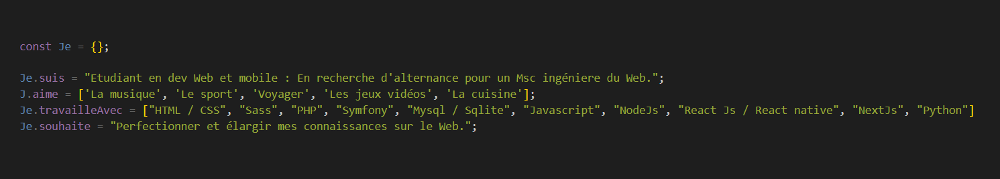

  <h1>Max Machin</h1>
  

    
  

  

&nbsp;
&nbsp;

  <h3>### A propos :</h3>

  

- :mortar_board: Developpeur Web Full-Stack en troisième année de Bachelor.

- :telescope: A la recherche d'une alternance pour un Master Of Science ingénierie du Web.

- :file_folder: Lien vers mon portfolio :arrow_right: https://max-machin.students-laplateforme.io/

- :mailbox: Me joindre par mail : max.machin@laplateforme.io

&nbsp;
&nbsp;

  <h3>### Skills :</h3>

&nbsp;

    &nbsp;
    &nbsp;
    &nbsp;
    &nbsp;
    &nbsp;
    &nbsp;
    &nbsp;
    &nbsp;
    &nbsp;
    &nbsp;
     

    &nbsp;
    &nbsp;
     &nbsp;

&nbsp;
&nbsp;

    &nbsp;
    

&nbsp;
&nbsp;

    &nbsp;
       &nbsp;     
    &nbsp;

&nbsp;
&nbsp;

     &nbsp;
       &nbsp;
     &nbsp;

&nbsp;
&nbsp;

  <h3>### Quelques chiffres :</h3>

  []     (https://github.com/anuraghazra/github-readme-stats)

